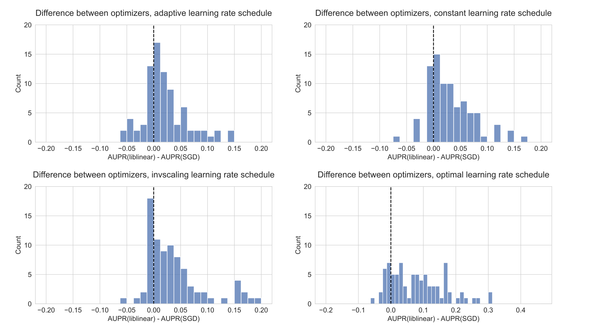

## Supplementary Material {.page_break_before}

In the main text (Results and Methods), we described why and how we binned models to allow a comparison of model complexity across optimizers with parameters that vary in opposite directions.
We also visualized the mapping of parameters to deciles, for `liblinear` and SGD separately, to quantify how well and how uniformly the model size deciles cover the range of parameters we used in the study.
Figure {@fig:parameter_to_decile} shows this mapping for KRAS mutation status classification.
The scikit-learn SGD implementation uses a regularization parameter $\alpha$ in which higher values mean more regularization (and thus models with fewer nonzero parameters), which is why lower SGD parameters map to higher deciles and vice-versa.
`liblinear`, on the other hand, uses an inverse regularization parameter C in which higher values mean less regularization, so lower parameters map to lower deciles.
We can see that most deciles contain anywhere from 1-3 different parameters (i.e. different models).

{#fig:parameter_to_decile tag="S1" width="100%"}

To motivate the choice of deciles of the nonzero coefficient distribution over a linear binning scheme, we also visualized the distribution of nonzero coefficients for KRAS mutation prediction models, showing the boundaries of deciles and linear bins.
We see that the distribution is skewed toward very simple models (using no nonzero parameters, or only a few) and toward complex models (with most parameters set to be nonzero), so many of the linear bins covering intermediate values contain no models or very few models (Figure {@fig:coefs_dist}).
Based on this, and the observation that the distributions look similar for most genes, we decided to bin models based on deciles to ensure more uniform coverage of models with different complexities.
We also plotted the performance results for linear bins, similar to figures {@fig:optimizer_compare_mutations}A and {@fig:optimizer_compare_mutations}B in the main text, and general trends were mostly the same, although variation was mostly compressed to the smallest and largest bins.

{#fig:coefs_dist tag="S2" width="90%"}

We can also visualize performance directly against the regularization parameters used for both `liblinear` and SGD.
We can see that the trends are generally the same for KRAS, with `liblinear` overfitting for more complex models to the right of the plot, and SGD performing best for more complex models to the left of the plot (Figure {@fig:parameter_vs_perf}).
Although it ultimately preserves the same message, we think this is visually more challenging to interpret than the plots in Figure {@fig:optimizer_compare_mutations} that use decile bins: since the parameters vary in different directions it makes it harder to assess which model is performing better, and for which level of regularization/complexity on the x-axis the best performance is reached, etc.

{#fig:parameter_vs_perf tag="S3" width="100%"}
