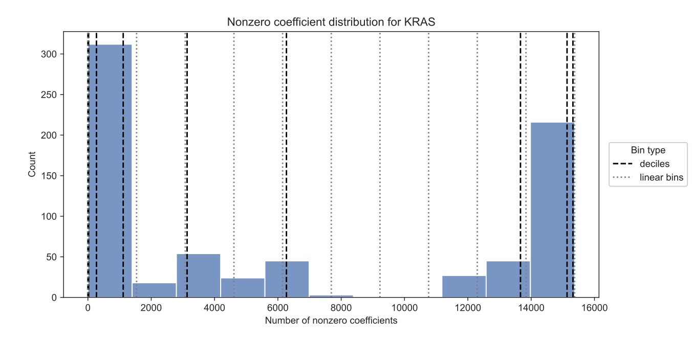

---
title: Optimizers manuscript
keywords:
- markdown
- publishing
- manubot
lang: en-US
date-meta: '2023-05-02'
author-meta:
- Jake Crawford
- Casey S. Greene
header-includes: |
  <!--
  Manubot generated metadata rendered from header-includes-template.html.
  Suggest improvements at https://github.com/manubot/manubot/blob/main/manubot/process/header-includes-template.html
  -->
  <meta name="dc.format" content="text/html" />
  <meta property="og:type" content="article" />
  <meta name="dc.title" content="Optimizers manuscript" />
  <meta name="citation_title" content="Optimizers manuscript" />
  <meta property="og:title" content="Optimizers manuscript" />
  <meta property="twitter:title" content="Optimizers manuscript" />
  <meta name="dc.date" content="2023-05-02" />
  <meta name="citation_publication_date" content="2023-05-02" />
  <meta property="article:published_time" content="2023-05-02" />
  <meta name="dc.modified" content="2023-05-02T15:18:45+00:00" />
  <meta property="article:modified_time" content="2023-05-02T15:18:45+00:00" />
  <meta name="dc.language" content="en-US" />
  <meta name="citation_language" content="en-US" />
  <meta name="dc.relation.ispartof" content="Manubot" />
  <meta name="dc.publisher" content="Manubot" />
  <meta name="citation_journal_title" content="Manubot" />
  <meta name="citation_technical_report_institution" content="Manubot" />
  <meta name="citation_author" content="Jake Crawford" />
  <meta name="citation_author_institution" content="Genomics and Computational Biology Graduate Group, Perelman School of Medicine, University of Pennsylvania, Philadelphia, PA, USA" />
  <meta name="citation_author_orcid" content="0000-0001-6207-0782" />
  <meta name="twitter:creator" content="@jjc2718" />
  <meta name="citation_author" content="Casey S. Greene" />
  <meta name="citation_author_institution" content="Department of Biochemistry and Molecular Genetics, University of Colorado School of Medicine, Aurora, CO, USA" />
  <meta name="citation_author_institution" content="Center for Health AI, University of Colorado School of Medicine, Aurora, CO, USA" />
  <meta name="citation_author_orcid" content="0000-0001-8713-9213" />
  <meta name="twitter:creator" content="@GreeneScientist" />
  <link rel="canonical" href="https://greenelab.github.io/optimizer-manuscript/" />
  <meta property="og:url" content="https://greenelab.github.io/optimizer-manuscript/" />
  <meta property="twitter:url" content="https://greenelab.github.io/optimizer-manuscript/" />
  <meta name="citation_fulltext_html_url" content="https://greenelab.github.io/optimizer-manuscript/" />
  <meta name="citation_pdf_url" content="https://greenelab.github.io/optimizer-manuscript/manuscript.pdf" />
  <link rel="alternate" type="application/pdf" href="https://greenelab.github.io/optimizer-manuscript/manuscript.pdf" />
  <link rel="alternate" type="text/html" href="https://greenelab.github.io/optimizer-manuscript/v/0ca385b03cee75525f39dc9c2a5c9eb8c4bcbb04/" />
  <meta name="manubot_html_url_versioned" content="https://greenelab.github.io/optimizer-manuscript/v/0ca385b03cee75525f39dc9c2a5c9eb8c4bcbb04/" />
  <meta name="manubot_pdf_url_versioned" content="https://greenelab.github.io/optimizer-manuscript/v/0ca385b03cee75525f39dc9c2a5c9eb8c4bcbb04/manuscript.pdf" />
  <meta property="og:type" content="article" />
  <meta property="twitter:card" content="summary_large_image" />
  <link rel="icon" type="image/png" sizes="192x192" href="https://manubot.org/favicon-192x192.png" />
  <link rel="mask-icon" href="https://manubot.org/safari-pinned-tab.svg" color="#ad1457" />
  <meta name="theme-color" content="#ad1457" />
  <!-- end Manubot generated metadata -->
bibliography:
- content/manual-references.json
manubot-output-bibliography: output/references.json
manubot-output-citekeys: output/citations.tsv
manubot-requests-cache-path: ci/cache/requests-cache
manubot-clear-requests-cache: false
...

<small><em>
This manuscript
([permalink](https://greenelab.github.io/optimizer-manuscript/v/0ca385b03cee75525f39dc9c2a5c9eb8c4bcbb04/))
was automatically generated
from [greenelab/optimizer-manuscript@0ca385b](https://github.com/greenelab/optimizer-manuscript/tree/0ca385b03cee75525f39dc9c2a5c9eb8c4bcbb04)
on May 2, 2023.
</em></small>

## Authors

+ **Jake Crawford**
   
    {.inline_icon width=16 height=16}
    [0000-0001-6207-0782](https://orcid.org/0000-0001-6207-0782)
    · {.inline_icon width=16 height=16}
    [jjc2718](https://github.com/jjc2718)
    · {.inline_icon width=16 height=16}
    [jjc2718](https://twitter.com/jjc2718)
     
  <small>
     Genomics and Computational Biology Graduate Group, Perelman School of Medicine, University of Pennsylvania, Philadelphia, PA, USA
  </small>

+ **Casey S. Greene**
  ^[✉](#correspondence)^ 
    {.inline_icon width=16 height=16}
    [0000-0001-8713-9213](https://orcid.org/0000-0001-8713-9213)
    · {.inline_icon width=16 height=16}
    [cgreene](https://github.com/cgreene)
    · {.inline_icon width=16 height=16}
    [GreeneScientist](https://twitter.com/GreeneScientist)
     
  <small>
     Department of Biochemistry and Molecular Genetics, University of Colorado School of Medicine, Aurora, CO, USA; Center for Health AI, University of Colorado School of Medicine, Aurora, CO, USA
  </small>

::: {#correspondence}
✉ — Correspondence possible via [GitHub Issues](https://github.com/greenelab/optimizer-manuscript/issues)
or email to
Casey S. Greene \<casey.s.greene@cuanschutz.edu\>.

:::

## Abstract {.page_break_before}

## Introduction {.page_break_before}

Gene expression profiles are widely used to classify samples or patients into relevant groups or categories, both preclinically [@doi:10.1371/journal.pcbi.1009926; @doi:10.1093/bioinformatics/btaa150] and clinically [@doi:10.1200/JCO.2008.18.1370; @doi:10/bp4rtw].
To extract informative gene features and to perform classification, a diverse array of algorithms exist, and different algorithms perform well across varying datasets and tasks [@doi:10.1371/journal.pcbi.1009926].
Even within a given model class, multiple optimization methods can often be applied to find well-performing model parameters or to optimize a model's loss function.
One commonly used example is logistic regression.
The widely used scikit-learn Python package for machine learning [@url:https://jmlr.org/papers/v12/pedregosa11a.html] provides two modules for fitting logistic regression classifiers: `LogisticRegression`, which uses the `liblinear` coordinate descent method [@url:https://www.jmlr.org/papers/v9/fan08a.html] to find parameters that optimize the logistic loss function, and `SGDClassifier`, which uses stochastic gradient descent [@online-learning] to optimize the same loss function.

Using scikit-learn, we compared the `liblinear` (coordinate descent) and SGD optimization techniques for prediction of driver mutation status in tumor samples, across a wide variety of genes implicated in cancer initiation and development [@doi:10.1126/science.1235122].
We applied LASSO (L1-regularized) logistic regression, and tuned the strength of the regularization to compare model selection between optimizers.
We found that across a variety of models (i.e. varying regularization strengths), the training dynamics of the optimizers were considerably different: models fit using `liblinear` tended to perform best at fairly high regularization strengths (100-1000 nonzero features in the model) and overfit easily with low regularization strengths.
On the other hand, models fit using stochastic gradient descent tended to perform best at fairly low regularization strengths (10000+ nonzero features in the model), and overfitting was uncommon.

Our results caution against viewing optimizer choice as a "black box" component of machine learning modeling.
The observation that LASSO logistic regression models fit using SGD tended to perform best for low levels of regularization, across diverse driver genes, runs counter to conventional wisdom in machine learning for high-dimensional data which generally states that explicit regularization and/or feature selection is necessary.
Comparing optimizers/model implementations directly is rare in applications of machine learning for genomics, and our work shows that this choice can affect generalization and interpretation properties of the model significantly.
Based on our results, we recommend considering the appropriate optimization approach carefully based on the goals of each individual analysis.

## Methods {.page_break_before}

### Data download and preprocessing

To generate binary mutated/non-mutated gene labels for our machine learning model, we used mutation calls for TCGA Pan-Cancer Atlas samples from MC3 [@doi:10.1016/j.cels.2018.03.002] and copy number threshold calls from GISTIC2.0 [@doi:10.1186/gb-2011-12-4-r41].
MC3 mutation calls were downloaded from the Genomic Data Commons (GDC) of the National Cancer Institute, at <https://gdc.cancer.gov/about-data/publications/pancanatlas>.
Thresholded copy number calls are from an older version of the GDC data and are available here: <https://figshare.com/articles/dataset/TCGA_PanCanAtlas_Copy_Number_Data/6144122>.
We removed hypermutated samples, defined as two or more standard deviations above the mean non-silent somatic mutation count, from our dataset to reduce the number of false positives (i.e., non-driver mutations).
Any sample with either a non-silent somatic variant or a copy number variation (copy number gain in the target gene for oncogenes and copy number loss in the target gene for tumor suppressor genes) was included in the positive set; all remaining samples were considered negative for mutation in the target gene.

RNA sequencing data for TCGA was downloaded from GDC at the same link provided above for the Pan-Cancer Atlas.
We discarded non-protein-coding genes and genes that failed to map, and removed tumors that were measured from multiple sites.
After filtering to remove hypermutated samples and taking the intersection of samples with both mutation and gene expression data, 9074 total TCGA samples remained.

### Cancer gene set construction

In order to study mutation status classification for a diverse set of cancer driver genes, we started with the set of 125 frequently altered genes from Vogelstein et al. [@doi:10.1126/science.1235122] (all genes from Table S2A).
For each target gene, in order to ensure that the training dataset was reasonably balanced (i.e., that there would be enough mutated samples to train an effective classifier), we included only cancer types with at least 15 mutated samples and at least 5% mutated samples, which we refer to here as "valid" cancer types.
In some cases, this resulted in genes with no valid cancer types, which we dropped from the analysis.
Out of the 125 genes originally listed in the Vogelstein et al. cancer gene set, we retained 84 target genes after filtering for valid cancer types.

### Classifier setup and optimizer comparison details

We trained logistic regression classifiers to predict whether or not a given sample had a mutational event in a given target gene using gene expression features as explanatory variables.
Based on our previous work, gene expression is generally effective for this problem across many target genes, although other -omics types can be equally effective in many cases [@doi:10.1186/s13059-022-02705-y].
Our model was trained on gene expression data (X) to predict mutation presence or absence (y) in a target gene.
To control for varying mutation burden per sample and to adjust for potential cancer type-specific expression patterns, we included one-hot encoded cancer type and log~10~(sample mutation count) in the model as covariates.
Since gene expression datasets tend to have many dimensions and comparatively few samples, we used a LASSO penalty to perform feature selection [@doi:10.1111/j.2517-6161.1996.tb02080.x].
LASSO logistic regression has the advantage of generating sparse models (some or most coefficients are 0), as well as having a single tunable hyperparameter which can be easily interpreted as an indicator of regularization strength/model complexity.

To compare model selection across optimizers, we first split the "valid" cancer types into train (75%) and test (25%) sets.
We then split the training data into "subtrain" (66% of the training set) data to train the model on, and "holdout" (33% of the training set) data to perform model selection, i.e. to use to select the best-performing regularization parameter.
In each case, these splits were stratified by cancer type, i.e. each split had as close as possible to equal proportions of each cancer type included in the dataset for the given driver gene.
For the `liblinear` optimizer, we trained models using the following range of $C$ values (inverse of regularization strength; i.e. higher values = less regularization) : {0.001, 0.005, 0.01, 0.05, 0.1, 0.5, 1, 5, 10, 50, 100}.
For the SGD optimizer, we trained models using the following range of $\alpha$ values (proportional to regularization strength; i.e. higher values = more regularization) : {0.00001, 0.00005, 0.0001, 0.0005, 0.001, 0.005, 0.01, 0.05, 0.1, 0.5, 1, 5, 10}.
These hyperparmeter ranges were intended to give reasonable coverage across genes that included "underfit" models (predicting only the mean or using very few features, poor performance on all datasets), "overfit" models (performing perfectly on training data but comparatively poorly on cross-validation and test data), and a wide variety of models in between that typically included the best fits to the cross-validation and test data.

Since the optimizers we compared have regularization parameters that vary in opposite directions and on different scales, rather than comparing regularization strength directly we used the number of nonzero coefficients in the resulting models to make a like-to-like comparison of model complexity.
For each gene, we combined all models (2 random seeds and 4 cross-validation folds = 8 total models for each parameter) across both optimizers to establish an overall distribution of nonzero coefficient counts.
We then calculated the deciles of this distribution, and binned models by decile.
For some genes, there were enough models with no nonzero coefficients (i.e. dummy regressors/models that just predict the mean) that one or more decile boundaries were exactly 0.
In these cases, we combined the lower deciles bounded by 0 into a single bin, which resulted in fewer than 10 total bins.

## Results {.page_break_before}

For each of the 125 driver genes from the Vogelstein et al. 2013 paper, we trained models to predict mutation status (presence or absence) from RNA-seq data, derived from the TCGA Pan-Cancer Atlas.
For each optimizer, we trained LASSO logistic regression models across a variety of regularization parameters (see Methods for parameter range details), for 4 cross-validation splits x 2 replicates (random seeds) for a total of 8 different models per parameter.
Cross-validation splits were stratified by cancer type.

Previous work has shown that pan-cancer classifiers of Ras mutation status are accurate and biologically informative [@doi:10.1016/j.celrep.2018.03.046].
As model complexity increases (more nonzero coefficients) for the `liblinear` optimizer, we observe that performance increases then decreases, corresponding to overfitting for high model complexities/numbers of nonzero coefficients (Figure {@fig:optimizer_compare_mutations}A).
.
On the other hand, for the SGD optimizer, we observe an increase in performance as model complexity increases, with models having no nonzero coefficients performing the best (Figure {@fig:optimizer_compare_mutations}B).
In this case, top performance for SGD (the largest bin, i.e. furthest right on the x-axis) is slightly worse than top performance for `liblinear` (the third smallest bin): we observed a mean test AUPR of 0.618 for SGD vs. mean AUPR of 0.688 for `liblinear`.
As model complexity varies, similar performance trends tend to hold across a variety of driver genes in the Vogelstein dataset, and for a variety of approaches to quantifying model complexity (see Supplementary Data).

To determine if the relative performance improvement with `liblinear` tends to hold across the genes in the Vogelstein dataset at large, we compared performance for the best-performing models for each gene, between optimizers.
Figure {@fig:optimizer_compare_mutations}C shows the distribution of differences in performance across genes.
The distribution is generally shifted to the right, suggesting that `liblinear` generally tends to outperform SGD.
We saw that for 71/84 genes, performance for the best-performing model was better using `liblinear` than SGD, and for the other 13 genes performance was better using SGD.

![
**A.** Performance vs. model complexity (number of nonzero coefficients) for KRAS mutation status prediction, for `liblinear` optimizer. Bins are derived from deciles of coefficient count distribution across optimizers; additional detail in Methods. "Holdout" dataset is used in panel C and following figures for best-performing model selection, "test" data is completely held out from model selection and used for evaluation in panel C and following figures.
**B.** Performance vs. model complexity (number of nonzero coefficients) for KRAS mutation status prediction, for SGD optimizer.
**C.** Distribution of performance difference between best-performing model for `liblinear` and SGD optimizers, across all 84 genes in Vogelstein driver gene set. Positive numbers on the x-axis indicate better performance using `liblinear`, and negative numbers indicate better performance using SGD.
](images/figure_1.png){#fig:optimizer_compare_mutations width="100%"}

We next sought to determine whether there was a difference in the magnitudes of coefficients in the models resulting from the different optimization schemes.
Following up on the trend in Figure {@fig:optimizer_compare_mutations}, where we saw that the best-performing SGD model had many nonzero coefficients, we also see that in general across all genes, the best-performing SGD models tend to be bimodal, sometimes having few nonzero coefficients but often having many/all nonzero coefficients (Figure {@fig:optimizer_coefs}A).
By contrast, the `liblinear` models are almost always much sparser with fewer than 2500 nonzero coefficients, out of ~16100 total input features.

Despite the SGD models performing best with many nonzero coefficients, it could be the case that many of the coefficients could be "effectively" 0, or uninformative to the final model.
However, Figure {@fig:optimizer_coefs}B provides evidence that this is not the case, with most coefficients in the best-performing KRAS mutation prediction model using SGD being considerably larger than the coefficients in the best-performing model using `liblinear`, and very few close to 0.
This emphasizes that the different optimization methods result in fundamentally different models, relying on different numbers of features with nonzero coefficients in different magnitudes, rather than converging to similar models.

![
**A.** Distribution across genes of the number of nonzero coefficients included in best-performing LASSO logistic regression models. Violin plot density estimations are clipped at the ends of the observed data range, and boxes show the median/IQR.
**B.** Distribution of coefficient magnitudes for a single KRAS mutation prediction model (random seed 42, first cross-validation split), colored by optimizer. The x-axis shows the base-10 logarithm of the absolute value of each coefficient + 1 (since some coefficients are exactly 0), and the y-axis shows the base-10 log of the count of coefficients in each bin. Other random seeds and cross-validation splits are similar.
](images/figure_2.png){#fig:optimizer_coefs width="80%"}

## Discussion {.page_break_before}

Our results suggest that even for the same model, LASSO logistic regression, optimizer choice can affect model selection and performance.
Existing gene expression prediction benchmarks and pipelines typically use a single model implementation (and thus a single optimizer).
To our knowledge, the phenomenon we observed with SGD has not been documented in other applications of ML to genomic or transcriptomic data.
In the broader machine learning research community, however, similar patterns have been observed for both linear models and deep neural networks (e.g. [@doi:10.1073/pnas.1907378117; @arxiv:1611.03530]).
This is often termed "benign overfitting": the idea that "overfit" models, in the sense that they fit the training data perfectly and perform worse on the test data, can still outperform models that do not fit the training data as well or that have stronger explicit regularization.
Benign overfitting has been observed with, and attributed to, optimization using SGD, which is thought to provide a form of implicit regularization [@doi:10.1145/3446776; @url:http://proceedings.mlr.press/v134/zou21a.html].

We recommend thinking critically about optimizer choice, but this can be challenging for users that are inexperienced with machine learning or unfamiliar with how certain models are fit under the hood.
For example, R's `glmnet` package uses a cyclical coordinate descent algorithm to fit logistic regression models [@doi:10.18637/jss.v033.i01], which would presumably behave similarly to `liblinear`, but this is somewhat opaque in the `glmnet` documentation itself.
LASSO logistic regression is a convex optimization problem, meaning there is a single unique optimum of the loss function in contrast to more complex models such as neural networks, but this optimum can be computationally intensive to find in practice and there is no closed-form solution [@l1-logistic-regression].
Increased transparency and documentation in popular machine learning packages with respect to optimization, especially for models that are challenging to fit, would benefit new and unfamiliar users.

Similar to what we see in our SGD-optimized models, there exist other problems in gene expression analysis where using all available features is better than using a subset.
For example, using the full gene set improves correlations between preclinical cancer models and their tissue of origin, as compared to selecting genes based on variability or tissue-specificity [@doi:10.1101/2023.04.11.536431].
On the other hand, when predicting cell line viability from gene expression profiles, selecting features by Pearson correlation improves performance over using all features, similar to our `liblinear` classifiers [@doi:10.1101/2020.02.21.959627].
An avenue of future work for our SGD classifiers would be to interpret the coefficients and compare them systematically to the coefficients found using `liblinear`.
It could be useful to understand if the two optimization methods emphasize the same pathways or functional gene sets, or if there are patterns to which driver mutations perform better with more/fewer nonzero coefficients.

## Data and code availability {.page_break_before}

The data analyzed during this study were previously published as part of the TCGA Pan-Cancer Atlas project [@doi:10.1038/ng.2764], and are available from the NIH NCI Genomic Data Commons (GDC).
The scripts used to download and preprocess the datasets for this study are available at <https://github.com/greenelab/pancancer-evaluation/tree/master/00_process_data>, and the code used to carry out the analyses in this study is available at <https://github.com/greenelab/pancancer-evaluation/tree/master/01_stratified_classification>, both under the open-source BSD 3-clause license.
Equivalent versions of Figure {@fig:optimizer_compare_mutations}A and {@fig:optimizer_compare_mutations}B for all 84 genes in the Vogelstein et al. 2013 gene set are available on Figshare at <https://doi.org/10.6084/m9.figshare.22728644>, under a CC0 license.
This manuscript was written using Manubot [@doi:10.1371/journal.pcbi.1007128] and is available on GitHub at <https://github.com/greenelab/optimizer-manuscript> under the CC0-1.0 license.

## References {.page_break_before}

<!-- Explicitly insert bibliography here -->

## Supplementary Material {.page_break_before}

In the main text (Results and Methods), we described why and how we binned models to allow a comparison of model complexity across optimizers with parameters that vary in opposite directions.
We also visualized the mapping of parameters to deciles, for `liblinear` and SGD separately, to quantify how well and how uniformly the model size deciles cover the range of parameters we used in the study.
Figure {@fig:parameter_to_decile} shows this mapping for KRAS mutation status classification.
The scikit-learn SGD implementation uses a regularization parameter $\alpha$ in which higher values mean more regularization (and thus models with fewer nonzero parameters), which is why lower SGD parameters map to higher deciles and vice-versa.
`liblinear`, on the other hand, uses an inverse regularization parameter C in which higher values mean less regularization, so lower parameters map to lower deciles.
We can see that most deciles contain anywhere from 1-3 different parameters (i.e. different models).

{#fig:parameter_to_decile tag="S1" width="100%"}

To motivate the choice of deciles of the nonzero coefficient distribution over a linear binning scheme, we also visualized the distribution of nonzero coefficients for KRAS mutation prediction models, showing the boundaries of deciles and linear bins.
We see that the distribution is skewed toward very simple models (using no nonzero parameters, or only a few) and toward complex models (with most parameters set to be nonzero), so many of the linear bins covering intermediate values contain no models or very few models (Figure {@fig:coefs_dist}).
Based on this, and the observation that the distributions look similar for most genes, we decided to bin models based on deciles to ensure more uniform coverage of models with different complexities.
We also plotted the performance results for linear bins, similar to figures {@fig:optimizer_compare_mutations}A and {@fig:optimizer_compare_mutations}B in the main text, and general trends were mostly the same, although variation was mostly compressed to the smallest and largest bins.

{#fig:coefs_dist tag="S2" width="90%"}

We can also visualize performance directly against the regularization parameters used for both `liblinear` and SGD.
We can see that the trends are generally the same for KRAS, with `liblinear` overfitting for more complex models to the right of the plot, and SGD performing best for more complex models to the left of the plot (Figure {@fig:parameter_vs_perf}).
Although it ultimately preserves the same message, we think this is visually more challenging to interpret than the plots in Figure {@fig:optimizer_compare_mutations} that use decile bins: since the parameters vary in different directions it makes it harder to assess which model is performing better, and for which level of regularization/complexity on the x-axis the best performance is reached, etc.

{#fig:parameter_vs_perf tag="S3" width="100%"}

